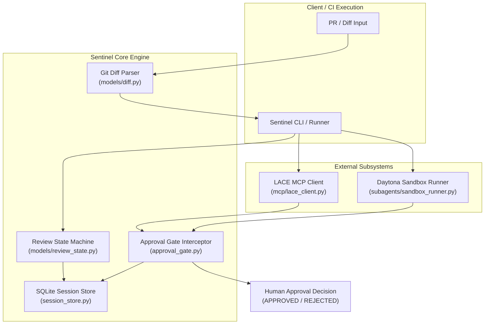

# Sentinel

Sentinel is an automated architectural guardrail and subagent verification system for AI-assisted software development. It intercepts pull requests and code modifications, validates proposed changes against Architecture Decision Records (ADRs) stored in the Local AI Context Engine (LACE), executes test suites in isolated Daytona cloud sandboxes, and presents a structured human-in-the-loop approval gate before commits or pull requests can merge.

---

## Architecture Overview



---

## Domain Model and Core Concepts

### 1. Architecture Decision Records (ADRs)
Sentinel implements MADR 3.0.0 (Markdown Any Architecture Decision Records). ADRs capture technical decisions, context, positive/negative consequences, and current status (`draft`, `proposed`, `accepted`, `rejected`, `deprecated`, `superseded`).

### 2. Review Sessions and State FSM
Review lifecycles progress through deterministic states governed by strict transition rules:
- `PENDING_SUBAGENTS`: Review session created, awaiting subagent evaluations.
- `PENDING_HUMAN_APPROVAL`: Subagents completed, interactive card presented to human reviewer.
- `APPROVED`: Human reviewer accepted changes; session is permanently sealed in terminal state.
- `REJECTED`: Human reviewer rejected changes; session is permanently sealed in terminal state.

### 3. Daytona Sandbox Execution
Subagent A provisions an ephemeral Debian/Python 3.13 container on Daytona Cloud:
- Synchronizes full repository workspace context (fixtures, package manifests, documentation).
- Runs dependency synchronization (`uv sync --dev`).
- Runs optional linters with non-fatal isolation.
- Runs authoritative test suites with automatic result parsing.
- Executes bounded-retry cleanup teardowns to prevent cloud resource leaks.

### 4. Human-in-the-Loop Approval Gate
Aggregates test outputs and LACE architectural delta reports into an interactive Markdown card. Enforces exact-token matching (`approve` / `reject`) and fail-closed security.

---

## Key Files Map

| Path | Primary Responsibility |
| :--- | :--- |
| `src/sentinel/approval_gate.py` | Formats Markdown approval cards, processes interactive approval input, and records final audit decisions. |
| `src/sentinel/session_store.py` | SQLite persistence layer with automatic schema migration (table rebuilds for composite keys). |
| `src/sentinel/mcp/lace_client.py` | Async MCP client communicating with LACE memory servers; parses ADRs and tracks architectural context. |
| `src/sentinel/mcp/types.py` | Pydantic response models enforcing strict trust boundary validation for external MCP payloads. |
| `src/sentinel/models/adr.py` | MADR 3.0.0 parser and serializer handling YAML frontmatter and Markdown bodies. |
| `src/sentinel/models/diff.py` | Unified git diff parser supporting Unicode octal escapes, diff header isolation, and whitespace preservation. |
| `src/sentinel/models/review_state.py` | Domain enums and dataclasses (`ReviewSession`, `SubagentTask`, `ApprovalActionType`). |
| `src/sentinel/subagents/sandbox_runner.py` | Daytona cloud sandbox runner subagent with workspace synchronization and lifecycle safety guarantees. |
| `scripts/live_daytona_test.py` | End-to-end integration script executing real cloud sandbox tests and the human approval gate. |

---

## Prerequisites and Local Setup

### System Requirements
- Python >= 3.13
- `uv` package manager (>= 0.5.0 recommended)
- Git >= 2.30

### 1. Clone Repository and Install Dependencies

```bash
git clone https://github.com/AayushM0/sentinel.git
cd sentinel
uv sync --dev
```

### 2. Environment Variables

For live Daytona cloud verification, configure your API credentials:

```bash
# Linux / macOS
export DAYTONA_API_KEY="your_daytona_api_key"

# Windows PowerShell
$env:DAYTONA_API_KEY = "your_daytona_api_key"
```

---

## Developer Runbooks

### Run Automated Unit Tests

```bash
uv run pytest -v
```

### Run Standalone Self-Checks (Rule 2903681)

Sentinel modules include framework-free standalone test suites that can be executed directly without `pytest`:

```bash
uv run python src/sentinel/subagents/sandbox_runner.py
uv run python src/sentinel/models/diff.py
uv run python src/sentinel/models/adr.py
```

### Code Formatting and Linting

```bash
# Auto-format codebase
uv run ruff format src tests scripts

# Check linter rules
uv run ruff check src tests scripts

# Verify format compliance
uv run ruff format --check src tests scripts
```

### Live Cloud Sandbox Verification

```bash
uv run python scripts/live_daytona_test.py
```

---

## Quality and Compliance Invariants

1. **Rule 2903681 (Testability):** All non-trivial modules contain self-checks in `if __name__ == "__main__":` utilizing native `assert` statements and in-memory test doubles.
2. **Rule 2903657 (Trust Boundaries):** External data from MCP servers and CLI outputs must be validated through explicit Pydantic schemas before consumption.
3. **Rule 2903630 (Standard Library APIs):** String interpolation into shell execution is prohibited; all dynamic arguments must use `shlex.quote()`.
4. **Fail-Closed Gate Design:** Unrecognized or empty approval inputs default to rejection. Terminal states (`APPROVED`, `REJECTED`) are immutable.
5. **Path Containment:** File uploads canonicalize paths using `.resolve()` and enforce `is_relative_to()` to prevent symlink traversal and escapes.

---

## Troubleshooting and Debugging

### Issue: `ModuleNotFoundError: No module named 'daytona'`
- **Cause:** Daytona SDK is not installed in the active environment.
- **Solution:** Run with `uv run python <script>` to ensure the project virtual environment is active. Modules also include graceful import fallbacks for standalone execution.

### Issue: Daytona Cloud Cleanup Leak (`LEAKED_SANDBOX_<id>`)
- **Cause:** Network interruption during container deletion.
- **Solution:** `SandboxRunner` automatically retries deletion up to 3 times with exponential backoff. If all attempts fail, the sandbox ID is logged at `CRITICAL` level and embedded in `SandboxResult.logs` for manual cleanup in the Daytona dashboard.

### Issue: SQLite `ON CONFLICT clause does not match any PRIMARY KEY`
- **Cause:** Upgrading from legacy schemas where `subagent_tasks` had a single-column primary key.
- **Solution:** `SessionStore` runs an automatic table-rebuilding migration on startup to migrate existing tables to `PRIMARY KEY (session_id, task_id)`.
